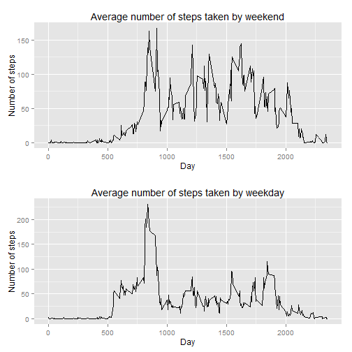

## Loading and preprocessing the data

The file activity.csv used in this study can be obtained [here](https://d396qusza40orc.cloudfront.net/repdata%2Fdata%2Factivity.zip) and in the same repository as this file on GitHub.

Before showing the answers for the questions, we need to load the data and convert the date values to a column of Date data type.

```r
## Just setting locale to English because my R Studio installation is in Portuguese.
Sys.setlocale("LC_TIME", "English")
```

```
## [1] "English_United States.1252"
```

```r
data_file <- read.csv("activity.csv")
data_file$date <- as.Date(data_file$date)
```


## What is mean total number of steps taken per day?

First we are required to show the number of steps the subject gave each day in the period.

```r
subtotal <- aggregate(steps ~ date, data_file, sum)
library(ggplot2)
qplot(subtotal$date, subtotal$steps, geom="histogram", stat="identity", main="Total steps per day", xlab="Date", ylab="Number os steps")
```

 

The mean of steps per day is equal to **10766.19** and the median is equal to **10765** steps per day.


## What is the average daily activity pattern?

If we calculate the average steps taken during the day, we get this pattern:

```r
subtotal2 <- aggregate(steps ~ interval, data_file, mean)
qplot(subtotal2$interval, subtotal2$steps, geom="line", main="Average number of steps taken by day", xlab="Day", ylab="Number of steps")
```

 

Calculating the period of the day with the max number of steps:

```r
max_average_steps <- subtotal2[which.max(subtotal2$steps),]
```

Usually the subject walks more in the 5-minute interval **835** with an average of **206.1698113** steps.


## Imputing missing values

There are **2304** missing values in this dataset.

To change that and assume some valid data to these missing values, I am replacing it with the mean of the number of steps in the same 5-minute interval.


```r
## Making a copy of the original data frame
data_file2 <- data_file

## Replacing the missing values
data_file2$steps <- ifelse(is.na(data_file2$steps) == TRUE, subtotal2$steps[subtotal2$interval %in% data_file2$interval], data_file2$steps) 
```

And showing a new histogram based on the changed data (without the missing values).

```r
subtotal3 <- aggregate(steps ~ date, data_file2, sum)
qplot(subtotal3$date, subtotal3$steps, geom="histogram", stat="identity", main="Total steps per day (without missing values)", xlab="Date", ylab="Number os steps")
```

 

As you can notice this plot is a little bit different from the previous one, that contains missing values.

The new value of the mean of steps per day (without missing values) is equal to **10766.19** and the new median is equal to **10766.19** steps per day.

As I use the mean as the new values (replacing the missing ones), there is a small difference only in the median, that now is equal to the mean.


## Are there differences in activity patterns between weekdays and weekends?

To answer this question I will insert a new column in the dataset labeling each date as a weekday or weekend.


```r
weekday_name <- data.frame(weekdays(data_file2$date))
colnames(weekday_name) <- "name"
weekday_name[] <- lapply(weekday_name, as.character)
weekday_name$name[weekday_name$name == "Sunday"] <- "Weekend"
weekday_name$name[weekday_name$name == "Saturday"] <- "Weekend"
weekday_name$name[weekday_name$name == "Monday"] <- "Weekday"
weekday_name$name[weekday_name$name == "Tuesday"] <- "Weekday"
weekday_name$name[weekday_name$name == "Wednesday"] <- "Weekday"
weekday_name$name[weekday_name$name == "Thursday"] <- "Weekday"
weekday_name$name[weekday_name$name == "Friday"] <- "Weekday"

data_file3 <- cbind(data_file2, weekday_name)
```

Then I will create two separate datasets: one for weekends and another for weekdays.

```r
data_file_weekday <- subset(data_file3, name=="Weekday")
data_file_weekend <- subset(data_file3, name=="Weekend")

subtotal_data_file_weekday <- aggregate(steps ~ interval, data_file_weekday, mean)
subtotal_data_file_weekend <- aggregate(steps ~ interval, data_file_weekend, mean)
```

And two new plots showing the average steps on weekends and weekdays.

```r
p1 <- qplot(subtotal_data_file_weekend$interval, subtotal_data_file_weekend$steps, geom="line", main="Average number of steps taken by weekend", xlab="Day", ylab="Number of steps")

p2 <- qplot(subtotal_data_file_weekday$interval, subtotal_data_file_weekday$steps, geom="line", main="Average number of steps taken by weekday", xlab="Day", ylab="Number of steps")

library(gridExtra)

grid.arrange(p1, p2, nrow=2)
```

 
